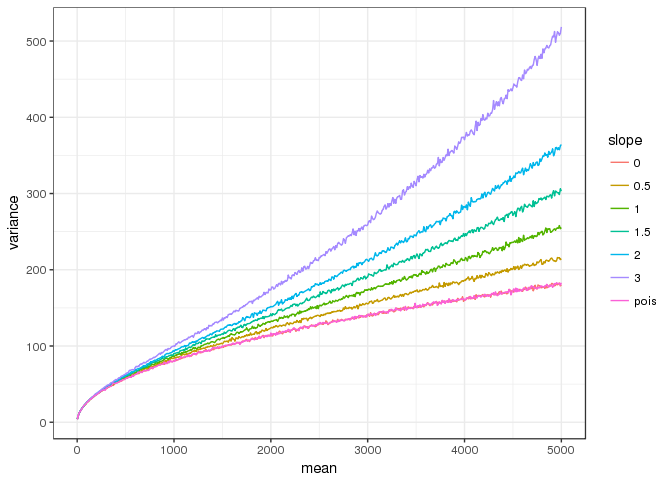
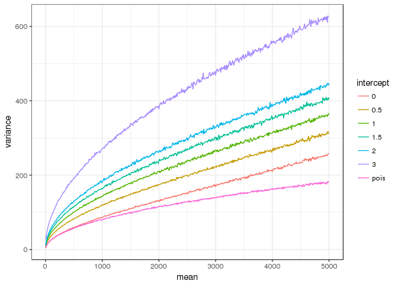
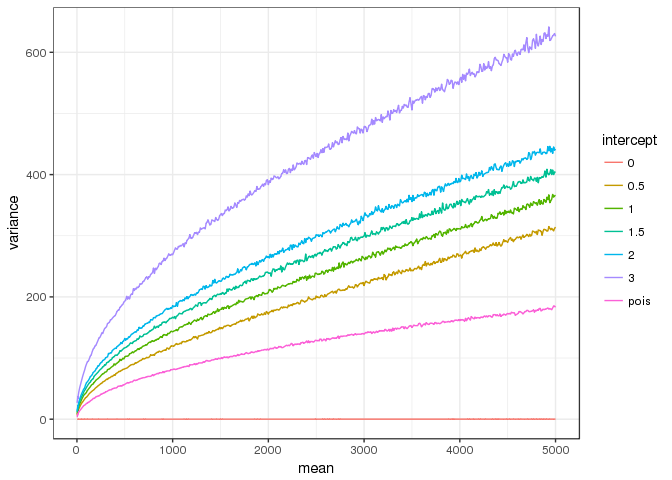

Modelling overdispersion
================
Mangiola Stefano
15/06/2018

-   [Both negative binomial and gamma can limit to a poisson](#both-negative-binomial-and-gamma-can-limit-to-a-poisson)
-   [Gamma with increasing overdispersion - fixing rate](#gamma-with-increasing-overdispersion---fixing-rate)
-   [Negative binomial with increasing overdispersion](#negative-binomial-with-increasing-overdispersion)
-   [Gamma + negative binomial](#gamma-negative-binomial)
-   [Reparametrise the gamma](#reparametrise-the-gamma)
-   [Gamma reparametrised + gamma + negative binomial](#gamma-reparametrised-gamma-negative-binomial)
-   [Gamma with added variance dependence - slope changing](#gamma-with-added-variance-dependence---slope-changing)
-   [Gamma with added variance dependence - intercept changing](#gamma-with-added-variance-dependence---intercept-changing)
-   [Dirichlet](#dirichlet)
-   [Negative binomial with added variance dependence - slope changing](#negative-binomial-with-added-variance-dependence---slope-changing)

Here I show at what extent we can approximate overdispersed poisson with negative binomial or gamma distributions

Both negative binomial and gamma can limit to a poisson
=======================================================

However gamma and negative binomial introduce overdispersion "generalising" the relation between expected value and variance of the poisson in a different way

Gamma with increasing overdispersion - fixing rate
==================================================

Negative binomial with increasing overdispersion
================================================

Gamma + negative binomial
=========================

Reparametrise the gamma
=======================

to have constant SD and apply a linear dependence between SD and mean

Gamma reparametrised + gamma + negative binomial
================================================

Gamma with added variance dependence - slope changing
=====================================================

Gamma with added variance dependence - intercept changing
=========================================================

Dirichlet
=========

Negative binomial with added variance dependence - slope changing
=================================================================

