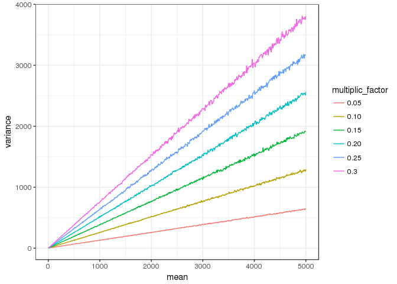

gamma\_approx\_to\_nb
================
Mangiola Stefano
15/06/2018

-   [Comparison of overdispersion between gamma, negative binomial, with poisson](#comparison-of-overdispersion-between-gamma-negative-binomial-with-poisson)

    ## ── Attaching packages ───────────────────────────────────────────────────────────────────────────────────────────────────────────────────────────────────────────── tidyverse 1.2.1 ──

    ## ✔ ggplot2 2.2.1     ✔ purrr   0.2.4
    ## ✔ tibble  1.4.2     ✔ dplyr   0.7.5
    ## ✔ tidyr   0.8.1     ✔ stringr 1.3.1
    ## ✔ readr   1.1.1     ✔ forcats 0.3.0

    ## ── Conflicts ──────────────────────────────────────────────────────────────────────────────────────────────────────────────────────────────────────────────── tidyverse_conflicts() ──
    ## ✖ purrr::accumulate() masks foreach::accumulate()
    ## ✖ dplyr::filter()     masks stats::filter()
    ## ✖ dplyr::lag()        masks stats::lag()
    ## ✖ purrr::when()       masks foreach::when()

Comparison of overdispersion between gamma, negative binomial, with poisson
---------------------------------------------------------------------------

Both negative binomial and gamma can limit to a poisson

``` r
mm = c(seq(2, 10, 1), seq(10, 5000, 10))
my_df = 
    
    # Gamma
    foreach(m = mm, .combine = bind_rows) %do% {
    s=1

    x = rgamma(10000,shape = m * s, rate = s)
    
    c(mean = m, spread = abs(quantile(x, 0.1) - quantile(x, 0.9)))
    } %>% 
    rename("gamma" = `spread.10%`) %>% 
    
    # Negative binomial
    left_join(
        foreach(m = mm, .combine = bind_rows) %do% {
            s=1000000
            x = rnbinom(10000, mu = m, size = s)
            c(mean = m, spread = abs(quantile(x, 0.1) - quantile(x, 0.9)))
        } %>% 
            rename("nb" = `spread.10%`),
    by="mean"
    ) %>%
        
    # Poisson
    left_join(
        foreach(m = mm, .combine = bind_rows) %do% {
            
            x = rpois(10000, lambda = m)
            
            c(mean = m, spread = abs(quantile(x, 0.1) - quantile(x, 0.9)))
        } %>% rename("pois" = `spread.10%`),
        by="mean"
    ) %>%
        gather(label, spread, -mean) 
```


However gamma and negative binomial introduce overdispersion "generalising" the relation between expected value and variance of the poisson in a different way

This is the gamma with increasing overdispersion, from poisson.

``` r
mm = c(seq(2, 10, 1), seq(10, 5000, 10))
my_df = 
    
    # Gamma
    foreach(m = mm, .combine = bind_rows) %do% {
        s=1
        x = rgamma(10000,shape = m * s, rate = s)
        c(mean = m, spread = abs(quantile(x, 0.1) - quantile(x, 0.9)))
    } %>% 
    rename("1" = `spread.10%`) %>% 
        
    # Gamma
    left_join(
        foreach(m = mm, .combine = bind_rows) %do% {
            s=0.8
            x = rgamma(10000,shape = m * s, rate = s)
            c(mean = m, spread = abs(quantile(x, 0.1) - quantile(x, 0.9)))
        }  %>% rename("0.8" = `spread.10%`),
        by="mean"
    ) %>%
    
    # Gamma
    left_join(
        foreach(m = mm, .combine = bind_rows) %do% {
            s=0.6
            x = rgamma(10000,shape = m * s, rate = s)
            c(mean = m, spread = abs(quantile(x, 0.1) - quantile(x, 0.9)))
        }  %>% rename("0.6" = `spread.10%`),
        by="mean"
    ) %>%
    
    # Gamma
    left_join(
        foreach(m = mm, .combine = bind_rows) %do% {
            s=0.4
            x = rgamma(10000,shape = m * s, rate = s)
            c(mean = m, spread = abs(quantile(x, 0.1) - quantile(x, 0.9)))
        }  %>% rename("0.4" = `spread.10%`),
        by="mean"
    ) %>%
    
    # Gamma
    left_join(
        foreach(m = mm, .combine = bind_rows) %do% {
            s=0.2
            x = rgamma(10000,shape = m * s, rate = s)
            c(mean = m, spread = abs(quantile(x, 0.1) - quantile(x, 0.9)))
        }  %>% rename("0.2" = `spread.10%`),
        by="mean"
    ) %>%
    
    # Gamma
    left_join(
        foreach(m = mm, .combine = bind_rows) %do% {
            s=0.1
            x = rgamma(10000,shape = m * s, rate = s)
            c(mean = m, spread = abs(quantile(x, 0.1) - quantile(x, 0.9)))
        }  %>% rename("0.1" = `spread.10%`),
        by="mean"
    ) %>%
        gather(rate_param_R_gamma, spread, -mean) 
```


This is the negative binomial with increasing overdispersion, from poisson.

``` r
mm = c(seq(2, 10, 1), seq(10, 5000, 10))
my_df = 
    
    # Negative binomial
    foreach(m = mm, .combine = bind_rows) %do% {
            s=1000000
            x = rnbinom(10000, mu = m, size = s)
            c(mean = m, spread = abs(quantile(x, 0.1) - quantile(x, 0.9)))
        } %>% 
    rename("1000000" = `spread.10%`) %>% 
        
    # Negative binomial
    left_join(
        foreach(m = mm, .combine = bind_rows) %do% {
            s=100000
            x = rnbinom(10000, mu = m, size = s)
            c(mean = m, spread = abs(quantile(x, 0.1) - quantile(x, 0.9)))
        }  %>% rename("100000" = `spread.10%`),
        by="mean"
    ) %>%
    
    # Negative binomial
    left_join(
        foreach(m = mm, .combine = bind_rows) %do% {
            s=10000
            x = rnbinom(10000, mu = m, size = s)
            c(mean = m, spread = abs(quantile(x, 0.1) - quantile(x, 0.9)))
        } %>% rename("10000" = `spread.10%`),
        by="mean"
    ) %>%
    
    # Negative binomial
    left_join(
        foreach(m = mm, .combine = bind_rows) %do% {
            s=1000
            x = rnbinom(10000, mu = m, size = s)
            c(mean = m, spread = abs(quantile(x, 0.1) - quantile(x, 0.9)))
        }  %>% rename("1000" = `spread.10%`),
        by="mean"
    ) %>%
    
    # Negative binomial
    left_join(
        foreach(m = mm, .combine = bind_rows) %do% {
            s=100
            x = rnbinom(10000, mu = m, size = s)
            c(mean = m, spread = abs(quantile(x, 0.1) - quantile(x, 0.9)))
        }  %>% rename("100" = `spread.10%`),
        by="mean"
    ) %>%
    
    # Negative binomial
    left_join(
        foreach(m = mm, .combine = bind_rows) %do% {
            s=10
            x = rnbinom(10000, mu = m, size = s)
            c(mean = m, spread = abs(quantile(x, 0.1) - quantile(x, 0.9)))
        } %>% rename("10" = `spread.10%`),
        by="mean"
    ) %>%
        gather(size_param_R_nb, spread, -mean) 
```


If we superimpone gamma and negative binomial

``` r
mm = c(seq(2, 10, 1), seq(10, 5000, 10))
my_df = 
    
    # Negative binomial
    foreach(m = mm, .combine = bind_rows) %do% {
            s=3000
            x = rnbinom(10000, mu = m, size = s)
            c(mean = m, spread = abs(quantile(x, 0.1) - quantile(x, 0.9)))
        } %>% rename("negative binomial" = `spread.10%`) %>%
    
    # Gamma
    left_join(
        foreach(m = mm, .combine = bind_rows) %do% {
            s=0.4
            x = rgamma(10000,shape = m * s, rate = s)
            c(mean = m, spread = abs(quantile(x, 0.1) - quantile(x, 0.9)))
        }  %>% rename("gamma" = `spread.10%`),
        by="mean"
    ) %>% 
    gather(Label, spread, -mean) 
```


Now let's try to reparametrise the gamma to have constant SD and apply a linear dependence between SD and mean

``` r
mm = c(seq(2, 10, 1), seq(10, 5000, 10))
my_df = 
    
    # Gamma
    foreach(m = mm, .combine = bind_rows) %do% {
        s=1
        s = s + 0.3 * m
        
        v = s^2;
        shape = m^2 / v;
        rate = m / v;
        
        x = rgamma(10000,shape = shape, rate = rate)
            
        c(mean = m, spread = abs(quantile(x, 0.1) - quantile(x, 0.9)))
    } %>% 
    rename("0.3" = `spread.10%`) %>% 
        
    # Gamma
    left_join(
    foreach(m = mm, .combine = bind_rows) %do% {
        s=1
        s = s + 0.25 * m
        
        v = s^2;
        shape = m^2 / v;
        rate = m / v;
        
        x = rgamma(10000,shape = shape, rate = rate)
            
        c(mean = m, spread = abs(quantile(x, 0.1) - quantile(x, 0.9)))
    } %>% rename("0.25" = `spread.10%`),
        by="mean"
    ) %>%
    
    # Gamma
    left_join(
    foreach(m = mm, .combine = bind_rows) %do% {
        s=1
        s = s + 0.20 * m
        
        v = s^2;
        shape = m^2 / v;
        rate = m / v;
        
        x = rgamma(10000,shape = shape, rate = rate)
            
        c(mean = m, spread = abs(quantile(x, 0.1) - quantile(x, 0.9)))
    }  %>% rename("0.20" = `spread.10%`),
        by="mean"
    ) %>%
    
    # Gamma
    left_join(
    foreach(m = mm, .combine = bind_rows) %do% {
        s=1
        s = s + 0.15 * m
        
        v = s^2;
        shape = m^2 / v;
        rate = m / v;
        
        x = rgamma(10000,shape = shape, rate = rate)
            
        c(mean = m, spread = abs(quantile(x, 0.1) - quantile(x, 0.9)))
    }  %>% rename("0.15" = `spread.10%`),
        by="mean"
    ) %>%
    
    # Gamma
    left_join(
    foreach(m = mm, .combine = bind_rows) %do% {
        s=1
        s = s + 0.10 * m
        
        v = s^2;
        shape = m^2 / v;
        rate = m / v;
        
        x = rgamma(10000,shape = shape, rate = rate)
            
        c(mean = m, spread = abs(quantile(x, 0.1) - quantile(x, 0.9)))
    } %>% rename("0.10" = `spread.10%`),
        by="mean"
    ) %>%
    
    # Gamma
    left_join(
    foreach(m = mm, .combine = bind_rows) %do% {
        s=1
        s = s + 0.05 * m
        
        v = s^2;
        shape = m^2 / v;
        rate = m / v;
        
        x = rgamma(10000,shape = shape, rate = rate)
            
        c(mean = m, spread = abs(quantile(x, 0.1) - quantile(x, 0.9)))
    }  %>% rename("0.05" = `spread.10%`),
        by="mean"
    ) %>%
        gather(multiplic_factor, spread, -mean) 
```



If we superimpone gamma and negative binomial

``` r
mm = c(seq(2, 10, 1), seq(10, 5000, 10))
my_df = 
    
    # Negative binomial
    foreach(m = mm, .combine = bind_rows) %do% {
            s=3000
            x = rnbinom(10000, mu = m, size = s)
            c(mean = m, spread = abs(quantile(x, 0.1) - quantile(x, 0.9)))
        } %>% rename("negative binomial" = `spread.10%`) %>%
    
    # Gamma
    left_join(
        foreach(m = mm, .combine = bind_rows) %do% {
        s=10
        s = (s + 0.02 * m) 
        
        v = s^2;
        shape = m^2 / v;
        rate = m / v;
        
        x = rgamma(10000,shape = shape, rate = rate)
            
        c(mean = m, spread = abs(quantile(x, 0.1) - quantile(x, 0.9)))
    }  %>% rename("gamma_reparam" = `spread.10%`),
        by="mean"
    ) %>% 
    
    # Gamma
    left_join(
        foreach(m = mm, .combine = bind_rows) %do% {
            s=0.4
            x = rgamma(10000,shape = m * s, rate = s)
            c(mean = m, spread = abs(quantile(x, 0.1) - quantile(x, 0.9)))
        }  %>% rename("gamma" = `spread.10%`),
        by="mean"
    ) %>% 
    gather(Label, spread, -mean) 
```


